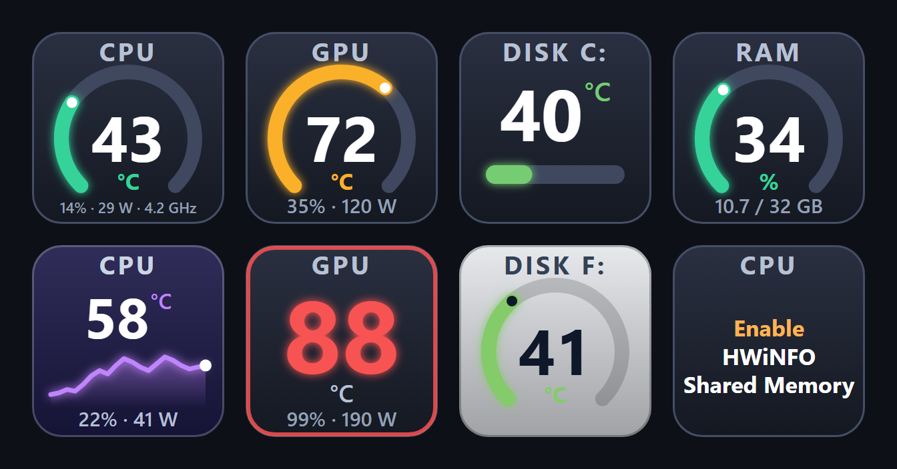

# Elemental Temps – Stream Deck plugin

CPU, GPU and disk temperatures plus RAM usage on your Stream Deck keys, shown as a circular gauge, a bar, a history graph or a big number. Optional load, power draw and clock speed. Flashes red when a temperature gets critical.



*Example keys with sample values: gauge, bar, history graph, big number, critical alarm, custom colors and background, and the message shown when HWiNFO Shared Memory is off.*

## Requirements

- Windows 10/11 and Stream Deck software **7.1** or newer
- [HWiNFO](https://www.hwinfo.com/) (the free version is enough) running in *Sensors* mode with **Shared Memory Support** enabled. RAM usage works without it. **Keep HWiNFO up to date** – new CPUs and graphics cards (for example the NVIDIA RTX 50 series) only show up in the sensor list in recent versions.

## Install and set up

1. Download `com.elemental.temps.streamDeckPlugin` from the [latest release](../../releases/latest) and double-click it.
2. In HWiNFO open *Settings* and enable **Shared Memory Support** (once).
3. Drag one of **CPU Temperature**, **GPU Temperature**, **Disk Temperature**, **RAM Usage** or **Custom Sensor** (category **Elemental Temps**) onto a key. Each action has its own settings; for disks and graphics cards you pick the exact drive / card from a list. **Custom Sensor** shows any reading HWiNFO exposes – water/coolant temperature, fan and pump RPM, voltages, power, load… – picked from a list grouped into Motherboard, CPU, GPU, APU, Disks and Fans, with an optional short label. Non-temperature readings have no default alarm thresholds.

> The free version of HWiNFO switches Shared Memory off after about 12 hours. When that happens the key shows **Enable HWiNFO Shared Memory** – just enable it again and the data comes back by itself.

Messages shown on a key instead of a value:

| Message | Meaning |
| --- | --- |
| **Enable HWiNFO Shared Memory** | The option is off or has expired |
| **Start HWiNFO** | HWiNFO is not running |
| **No data**, **No GPU**, **No disk** | HWiNFO is running, but no matching sensor was found. First check that the device has its own section with a temperature in the HWiNFO sensors window; if not, update HWiNFO |

## Options

- Chart type: gauge, bar, history graph, number only
- Color: automatic (green → amber → red by thresholds) or your own; background: default, black or custom
- Show or hide the sensor name; °C / °F
- CPU / GPU: load, power draw and clock speed on the bottom line
- Warning and critical thresholds, flashing red alarm with an optional sound
- What a key press does: refresh the reading or switch the chart type
- Language of the settings panel: English or Polish (Auto follows Stream Deck, or choose it yourself)

## Supported hardware

Sensors are matched by their HWiNFO labels, with priority lists for Intel (`CPU Package`), AMD (`CPU (Tctl/Tdie)`, `CPU PPT`) and for NVIDIA, AMD and Intel graphics (`GPU [#N]` sensors, or `iGPU [#N]` / `dGPU [#N]` in newer HWiNFO versions); disks come from the S.M.A.R.T. sensors. Developed and tested on Intel + NVIDIA; AMD and Radeon / Intel GPUs are supported through HWiNFO sensor names and are less tested. If a key shows *No data* although HWiNFO shows the sensor, the label probably differs – please open an issue and include the sensor name, or see `$rules` in `com.elemental.temps.sdPlugin/bin/hwinfo-shm.ps1`.

## Good to know

- The plugin starts a small `powershell.exe` helper to read HWiNFO's shared memory. Locked-down PCs or aggressive antivirus software may block it.
- Windows only.
- Nothing is sent over the network. The only connection is an optional local read from `localhost:8085` (LibreHardwareMonitor) used as a CPU fallback.

## Development

```
npm install
npm run deploy      # build + restart the plugin (Stream Deck restarts it by itself)
npm run typecheck
npx streamdeck pack com.elemental.temps.sdPlugin --output dist --force
```

- `src/sensors.ts` – readers (HWiNFO shared memory through a long-running PowerShell process; registry and LibreHardwareMonitor fallbacks for the CPU; RAM from the OS)
- `src/render.ts` – SVG key rendering
- `src/plugin.ts` – the four actions (cpu, gpu, disk, ram), polling, alarm
- `pi/template.html` + `scripts/gen-pi.mjs` – settings page template; the build generates one page per component (`ui/cpu.html`, …)
- `com.elemental.temps.sdPlugin/bin/hwinfo-shm.ps1` – shared memory reader

Idea for later: an own helper based on LibreHardwareMonitorLib (needs admin rights and a kernel driver) to drop the HWiNFO dependency.

## License

MIT – see [LICENSE](LICENSE). Third-party components bundled with the plugin and their licenses are listed in [THIRD-PARTY-NOTICES.txt](THIRD-PARTY-NOTICES.txt).
